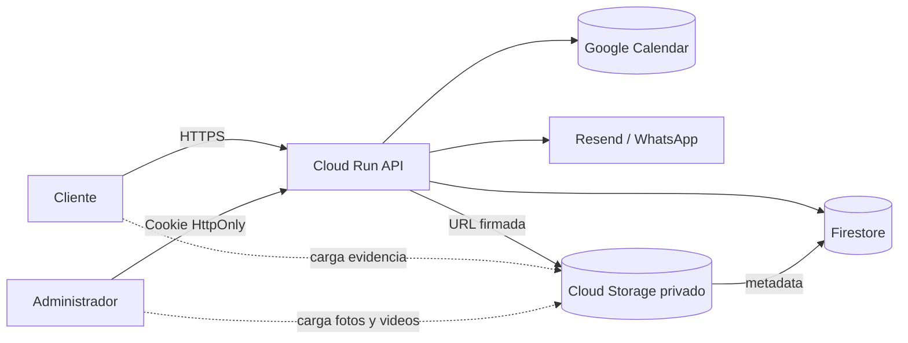
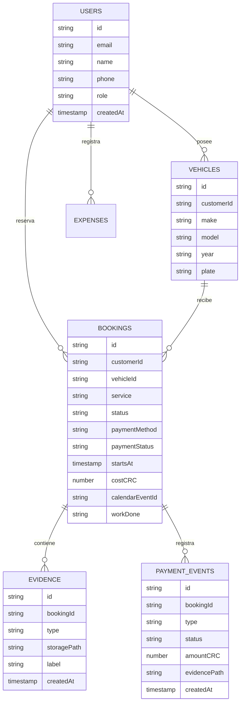
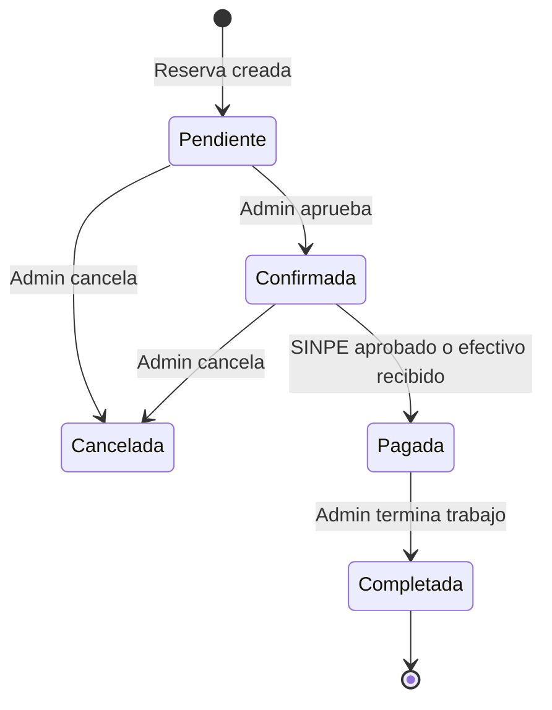

# Persistencia económica: Firestore + Cloud Storage

## Decisión

Se propone **Firestore Native** para usuarios, vehículos, reservas, pagos, gastos y bloqueos, y un bucket privado de **Cloud Storage** para comprobantes SINPE, fotografías, documentos y videos. Ambos servicios son serverless: no requieren una instancia encendida ni una cuota fija por servidor. Firestore cobra principalmente por operaciones y almacenamiento; Storage por bytes almacenados, operaciones y transferencia. Un recurso vacío no ejecuta cómputo, aunque los archivos y datos guardados sí generan el consumo correspondiente.

Cloud Run será la única capa con acceso a datos. El navegador nunca recibe credenciales del bucket ni acceso directo a Firestore. Para futuras cargas se usarán URLs firmadas de corta duración.

## Arquitectura



## Modelo de datos



## Flujo de reservación y pago



### SINPE Móvil

1. El cliente selecciona SINPE y ve el número configurado.
2. Cloud Run genera una URL firmada para `payments/{bookingId}/receipt`.
3. El cliente sube imagen o PDF al bucket privado.
4. Firestore registra el `storagePath`; la reserva sigue `Pendiente`.
5. El administrador revisa el comprobante y aprueba pago + reserva.
6. Se envían correos al cliente y a Josue.

### Efectivo

1. La reserva inicia `Pendiente` y `paymentStatus=Pendiente`.
2. El administrador aprueba la reserva.
3. El día de la cita marca `paymentStatus=Pagado`.
4. La interfaz habilita **Finalizar**.

### Tarjeta

El método permanecerá deshabilitado hasta elegir proveedor, completar afiliación, políticas, 3-D Secure y webhooks. Nunca se almacenarán números de tarjeta, CVV ni datos sensibles en Firestore.

## Estructura del bucket

```text
bookings/{bookingId}/
├── payments/
│   └── sinpe-receipt.{jpg|png|pdf}
├── before/
│   ├── exterior-01.jpg
│   └── interior-01.jpg
├── after/
│   ├── exterior-01.jpg
│   └── walkthrough.mp4
└── documents/
    └── service-report.pdf

tmp/{uploadId}/...
```

`tmp/` se elimina automáticamente después de siete días y las cargas multipart incompletas después de un día mediante `lifecycle.json`.

## Seguridad

* Bucket privado, acceso público prevenido y Uniform Bucket-Level Access.
* Cloud Run recibe `roles/datastore.user` y `roles/storage.objectAdmin` solamente sobre los recursos necesarios.
* Reglas de Firestore deniegan acceso directo desde navegadores.
* La API valida usuario, rol, tipo MIME, tamaño y pertenencia de la reserva.
* Las URLs firmadas deben expirar en 10–15 minutos.
* Los comprobantes financieros no deben incluir datos bancarios innecesarios.
* Auditoría de cada cambio de estado y pago en `paymentEvents`.

## Crear recursos

Estos recursos **no se crean al desplegar una revisión de Cloud Run**. La aplicación no debe crear infraestructura durante su arranque. Se preparan una sola vez ejecutando `setup.sh`; después, las revisiones nuevas reutilizan la misma base de datos y el mismo bucket. El script es idempotente, por lo que se puede volver a ejecutar sin duplicarlos.

Desde la raíz:

```bash
export PROJECT_ID="tu-id-de-proyecto"
export REGION="us-west1"
./GCP-infra/storage/setup.sh
```

El script es idempotente, crea Firestore solo si no existe, crea un bucket privado, aplica ciclo de vida y asigna permisos a la cuenta de Cloud Run.

Puedes ejecutarlo desde **Cloud Shell** o desde una Mac con `gcloud` autenticado. Cloud Build tampoco lo ejecuta en cada merge: `cloudbuild.yaml` solamente construye y despliega la aplicación, evitando que la cuenta del pipeline necesite permisos administrativos permanentes para crear bases de datos o modificar IAM.

## Desplegar índices y reglas

Los archivos `firestore.rules` y `firestore.indexes.json` están listos para Firebase CLI cuando se conecte el proyecto:

```bash
firebase use "$PROJECT_ID"
firebase deploy --config GCP-infra/storage/firebase.json --only firestore:rules,firestore:indexes
```

Las reservaciones se guardan en `bookings`, perfiles en `users`, autos en `vehicles`, gastos en `expenses`, bloqueos en `blockedDates` y comprobantes SINPE en el bucket privado. Firebase Authentication administra contraseñas; la aplicación nunca las escribe en Firestore ni `localStorage`. Una cookie HttpOnly relaciona la sesión con el UID y el historial usa `customerId`, conservando compatibilidad con reservas antiguas por correo. La disponibilidad se valida nuevamente en el servidor contra citas y bloqueos. En esta primera integración el comprobante viaja codificado en base64 con límite de 5 MB; para archivos grandes conviene usar URLs firmadas.

## Activar cuentas persistentes

1. En Firebase Console abre **Authentication → Sign-in method** y habilita **Email/Password**.
2. En **Project settings → General**, copia el **Web API Key**.
3. Sustituye `_FIREBASE_WEB_API_KEY` en `GCP-infra/cloudbuild.yaml` o configura `FIREBASE_WEB_API_KEY` al desplegar Cloud Run.
4. Despliega una revisión nueva y registra una cuenta de prueba.
5. Comprueba `Authentication → Users`, `Firestore → users` y `Firestore → vehicles`.

```bash
gcloud run services update proyectocardetailing \
  --region=us-west1 \
  --project="$PROJECT_ID" \
  --update-env-vars="FIREBASE_WEB_API_KEY=TU_WEB_API_KEY"
```

La cuenta puede volver a abrirse desde otro dispositivo. El servidor intercambia las credenciales con Firebase, crea una sesión segura y devuelve únicamente el perfil, autos y citas pertenecientes a ese UID.

## Verificar la integración desde el sitio

1. Despliega una revisión que defina `STORAGE_BUCKET`; el pipeline ya usa `${PROJECT_ID}-estudio-auto-evidence`.
2. Crea una cita de prueba, preferiblemente con un comprobante pequeño.
3. En Firestore, abre `bookings`: debe aparecer un documento con `calendarEventId`, `status` y `paymentStatus`.
4. En Cloud Storage, busca `bookings/{id}/payments/`: allí debe estar el comprobante.
5. Cierra el navegador, abre el panel administrativo e inicia sesión. El panel consulta `/api/admin/bookings` y debe mostrar el documento guardado, aunque `localStorage` esté vacío.
6. El escudo pequeño del panel aparece verde cuando los servicios internos están disponibles y rojo cuando requieren revisión. Los nombres técnicos y detalles quedan únicamente en Cloud Logging.

Los detalles técnicos se consultan únicamente en Cloud Logging. La interfaz muestra acciones concretas —revisar formato/tamaño, volver a intentar o elegir efectivo— sin mencionar proveedores internos.

También puedes comprobarlo desde Cloud Shell:

```bash
curl -H "Authorization: Bearer $(gcloud auth print-access-token)" \
  "https://firestore.googleapis.com/v1/projects/$PROJECT_ID/databases/(default)/documents/bookings?pageSize=10"
gcloud storage ls "gs://$PROJECT_ID-estudio-auto-evidence/bookings/**"
```

## Control de costos

1. Crear presupuestos y alertas en Cloud Billing (50%, 80% y 100%).
2. Mantener imágenes optimizadas y limitar videos.
3. Aplicar lifecycle a temporales y evidencias antiguas según política.
4. Paginar historial y evitar listeners permanentes innecesarios.
5. Usar caché y lecturas por demanda en Firestore.
6. Revisar mensualmente Storage Insights y métricas de Firestore.
