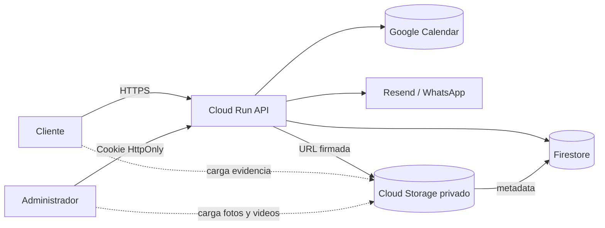
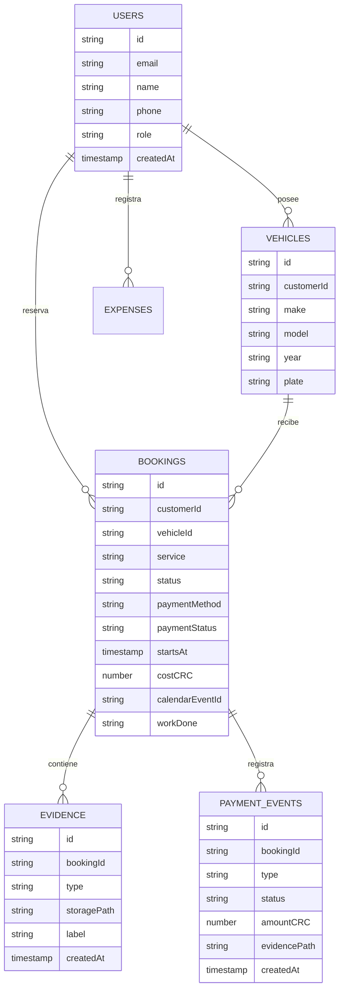
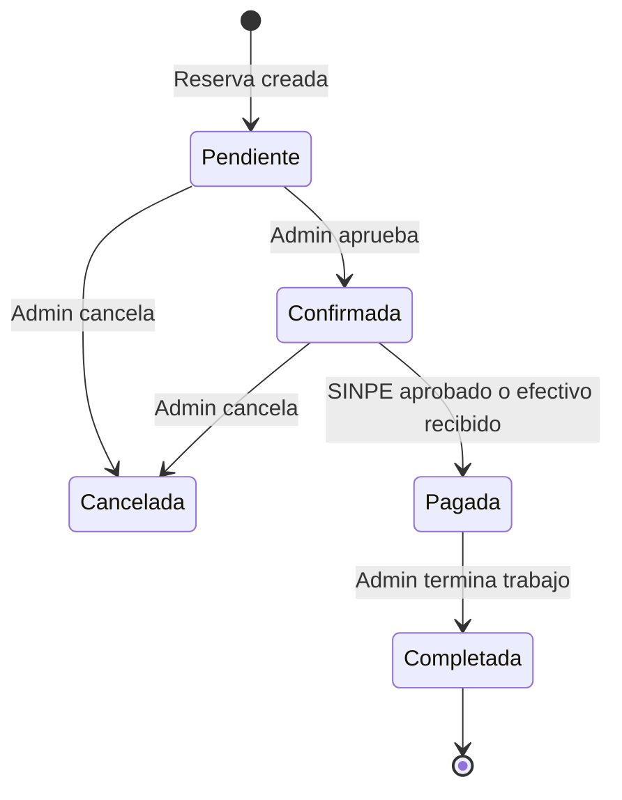

# Persistencia económica: Firestore + Cloud Storage

## Decisión

Se propone **Firestore Native** para usuarios, vehículos, reservas, pagos, gastos y bloqueos, y un bucket privado de **Cloud Storage** para comprobantes SINPE, fotografías, documentos y videos. Ambos servicios son serverless: no requieren una instancia encendida ni una cuota fija por servidor. Firestore cobra principalmente por operaciones y almacenamiento; Storage por bytes almacenados, operaciones y transferencia. Un recurso vacío no ejecuta cómputo, aunque los archivos y datos guardados sí generan el consumo correspondiente.

Cloud Run será la única capa con acceso a datos. El navegador nunca recibe credenciales del bucket ni acceso directo a Firestore. Para futuras cargas se usarán URLs firmadas de corta duración.

## Arquitectura



## Modelo de datos



## Flujo de reservación y pago



### SINPE Móvil

1. El cliente selecciona SINPE y ve el número configurado.
2. Cloud Run genera una URL firmada para `payments/{bookingId}/receipt`.
3. El cliente sube imagen o PDF al bucket privado.
4. Firestore registra el `storagePath`; la reserva sigue `Pendiente`.
5. El administrador revisa el comprobante y aprueba pago + reserva.
6. Se envían correos al cliente y a Josue.

### Efectivo

1. La reserva inicia `Pendiente` y `paymentStatus=Pendiente`.
2. El administrador aprueba la reserva.
3. El día de la cita marca `paymentStatus=Pagado`.
4. La interfaz habilita **Finalizar**.

### Tarjeta

El método permanecerá deshabilitado hasta elegir proveedor, completar afiliación, políticas, 3-D Secure y webhooks. Nunca se almacenarán números de tarjeta, CVV ni datos sensibles en Firestore.

## Estructura del bucket

```text
bookings/{bookingId}/
├── payments/
│   └── sinpe-receipt.{jpg|png|pdf}
├── before/
│   ├── exterior-01.jpg
│   └── interior-01.jpg
├── after/
│   ├── exterior-01.jpg
│   └── walkthrough.mp4
└── documents/
    └── service-report.pdf

tmp/{uploadId}/...
```

`tmp/` se elimina automáticamente después de siete días y las cargas multipart incompletas después de un día mediante `lifecycle.json`.

## Seguridad

* Bucket privado, acceso público prevenido y Uniform Bucket-Level Access.
* Cloud Run recibe `roles/datastore.user` y `roles/storage.objectAdmin` solamente sobre los recursos necesarios.
* Reglas de Firestore deniegan acceso directo desde navegadores.
* La API valida usuario, rol, tipo MIME, tamaño y pertenencia de la reserva.
* Las URLs firmadas deben expirar en 10–15 minutos.
* Los comprobantes financieros no deben incluir datos bancarios innecesarios.
* Auditoría de cada cambio de estado y pago en `paymentEvents`.

## Crear recursos

Desde la raíz:

```bash
export PROJECT_ID="tu-id-de-proyecto"
export REGION="us-west1"
./GCP-infra/storage/setup.sh
```

El script es idempotente, crea Firestore solo si no existe, crea un bucket privado, aplica ciclo de vida y asigna permisos a la cuenta de Cloud Run.

## Desplegar índices y reglas

Los archivos `firestore.rules` y `firestore.indexes.json` están listos para Firebase CLI cuando se conecte el proyecto:

```bash
firebase use "$PROJECT_ID"
firebase deploy --config GCP-infra/storage/firebase.json --only firestore:rules,firestore:indexes
```

Antes de producción falta implementar en el servidor los repositorios de Firestore, endpoints de URL firmada, validación de uploads, migración desde `localStorage` y pruebas de integración. La UI actual conserva únicamente el nombre del comprobante; no sube todavía el archivo real.

## Control de costos

1. Crear presupuestos y alertas en Cloud Billing (50%, 80% y 100%).
2. Mantener imágenes optimizadas y limitar videos.
3. Aplicar lifecycle a temporales y evidencias antiguas según política.
4. Paginar historial y evitar listeners permanentes innecesarios.
5. Usar caché y lecturas por demanda en Firestore.
6. Revisar mensualmente Storage Insights y métricas de Firestore.
